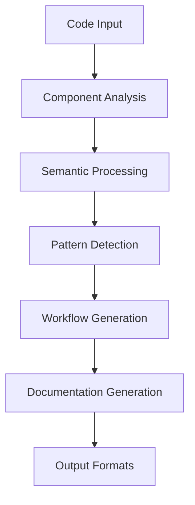
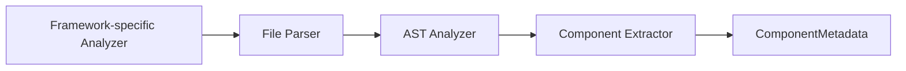
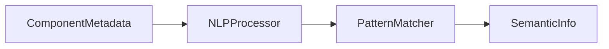
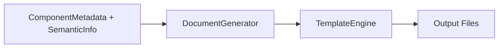
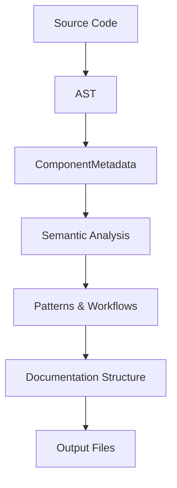

# UserLens System Patterns

## System Architecture
UserLens follows a modular, pipeline-based architecture that processes frontend code through several stages to generate user documentation.



## Key Architectural Patterns

### 1. Analyzer Pattern
The analyzer modules are responsible for parsing and extracting information from frontend code:



- **Implementation**: `ReactAnalyzer`, future: `VueAnalyzer`, `AngularAnalyzer`
- **Key Interfaces**: `ComponentAnalyzer`, `RouteAnalyzer`
- **Pattern Benefits**: Enables easy extension to multiple frameworks while maintaining consistent output format

### 2. Semantic Processor Pattern
The NLP and semantic processing modules extract meaning from technical component names and structures:



- **Implementation**: `NLPProcessor`, `PatternMatcher`
- **Key Interfaces**: `SemanticAnalyzer`
- **Pattern Benefits**: Decouples technical analysis from semantic meaning extraction

### 3. Documentation Generation Pattern
The generator modules transform semantic information into user documentation:



- **Implementation**: `MarkdownGenerator`, future: `HTMLGenerator`, `InteractiveGenerator`
- **Key Interfaces**: `DocumentGenerator`
- **Pattern Benefits**: Allows multiple output formats while keeping the same analysis process

## Data Models

### Core Data Models
1. **ComponentMetadata**: Represents a UI component with its properties and actions
2. **UserAction**: Describes an action a user can take (click, input, etc.)
3. **UserJourney**: Represents a sequence of steps to accomplish a task
4. **ComponentCategory**: Classification of components by their purpose

### Data Flow


## Design Patterns Used

### 1. Strategy Pattern
Used for different framework analyzers that implement the same interface:

```typescript
interface ComponentAnalyzer {
  parseComponent(filePath: string): Promise<ComponentMetadata>;
  extractUserActions(component: ComponentMetadata): UserAction[];
  identifyComponentPurpose(component: ComponentMetadata): string;
}

// Different implementations for different frameworks
class ReactAnalyzer implements ComponentAnalyzer { ... }
class VueAnalyzer implements ComponentAnalyzer { ... }
```

### 2. Facade Pattern
The CLI provides a simplified interface to the complex subsystems:

```typescript
// CLI command abstracts the complexity
program.command('analyze')
  .description('Analyze a frontend application')
  .action(async (options) => {
    // Facade hides the complexity of the analysis process
  });
```

### 3. Template Method Pattern
Documentation generators follow a template method pattern for consistent structure:

```typescript
// Base template methods
async generateDocumentation() {
  await this.generateOverview();
  await this.generateGettingStarted();
  await this.generateFeatures();
  await this.generateWorkflows();
}
```

## Extension Points

1. **Framework Analyzers**: Add new analyzers for different frontend frameworks
2. **Output Formats**: Add new document generators for different output formats
3. **Semantic Mappings**: Extend the semantic mappings to improve component description
4. **Pattern Detection**: Add new pattern detection algorithms for UI/UX patterns
5. **Template Customization**: Add custom templates for documentation generation

## Configuration System
UserLens uses a configuration file approach to customize behavior:

```json
{
  "framework": "react",
  "entry": "./src",
  "output": "./docs",
  "features": ["forms", "navigation", "authentication"],
  "customMappings": {
    "UserDashboard": "Your Personal Dashboard"
  },
  "excludePatterns": ["*.test.*"]
}
```

This allows users to customize without changing code and maintains consistency across runs. 