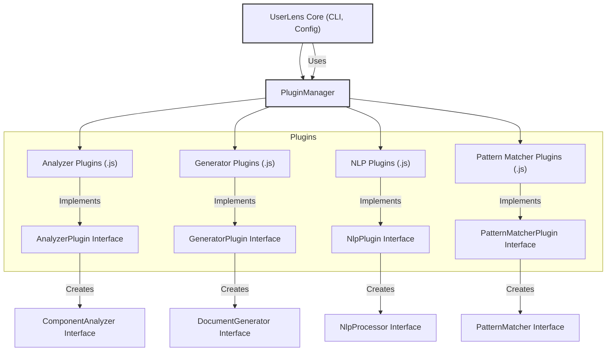
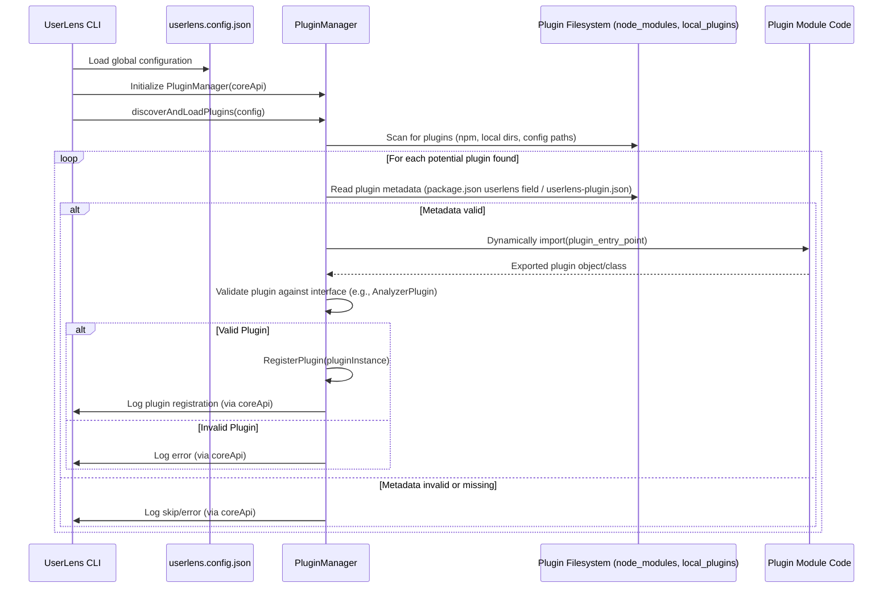

# UserLens Plugin Architecture Design

## 1. Introduction & Goals

This document outlines the proposed plugin architecture for the UserLens application. The primary goal is to enhance UserLens's flexibility and extensibility, allowing users and third-party developers to add new functionalities without modifying the core codebase.

This architecture will support the following types of plugins:

*   **Analyzer Plugins:** To parse and understand different frontend frameworks or specific code structures (e.g., Vue.js, Angular, custom component libraries).
*   **Generator Plugins:** To produce documentation in various output formats or styles (e.g., HTML, Confluence, custom PDF layouts).
*   **NLP Plugins:** To provide custom Natural Language Processing capabilities, such as specialized semantic categorization or description generation.
*   **Pattern Matcher Plugins:** To identify custom code patterns or architectural idioms within the analyzed codebase.

## 2. Plugin Definition

### 2.1. Plugin Structure

A UserLens plugin will be a Node.js module. It must export a default object or class that implements the relevant plugin interface.

**Option A: `package.json` Convention + Entry Point**

*   Plugins distributed via npm should follow a naming convention, e.g.:
    *   `userlens-analyzer-[name]` (e.g., `userlens-analyzer-vue`)
    *   `userlens-generator-[name]` (e.g., `userlens-generator-html`)
    *   `userlens-nlp-[name]`
    *   `userlens-patternmatcher-[name]`
*   The `package.json` of the plugin should have a `main` field pointing to the JavaScript file that exports the plugin implementation.
*   It can also include a `userlens` field in `package.json` for metadata:
    ```json
    // package.json (in a plugin)
    {
      "name": "userlens-analyzer-vue",
      "version": "0.1.0",
      "main": "dist/index.js",
      "userlens": {
        "type": "analyzer", // "generator", "nlp", "patternmatcher"
        "name": "VueAnalyzer", // User-friendly name
        "frameworks": ["vue"], // For analyzers
        "formats": [],         // For generators
        "capabilities": []     // For NLP/PatternMatchers
      }
    }
    ```

**Option B: Dedicated Metadata File**

*   Alternatively, or in addition (especially for local plugins), a `userlens-plugin.json` file in the plugin's root directory can declare its type and capabilities. This is useful if `package.json` modification is not desired or for non-npm plugins.

    ```json
    // userlens-plugin.json (in a plugin's root)
    {
      "type": "analyzer",
      "name": "VueAnalyzer",
      "entryPoint": "./dist/index.js", // Relative to plugin root
      "frameworks": ["vue"]
    }
    ```

For simplicity and leveraging the npm ecosystem, **Option A (package.json convention)** is preferred for discoverability, with the `userlens` field providing explicit metadata.

### 2.2. Plugin Interfaces

Plugins must implement specific interfaces based on their type. These interfaces will ensure a consistent contract with the UserLens core.

**Core Data Structures (from [`src/models/interfaces.ts`](./src/models/interfaces.ts) - may need slight adjustments):**

*   [`ComponentMetadata`](./src/models/interfaces.ts:24)
*   [`UserJourney`](./src/models/interfaces.ts:43)
*   [`PropDefinition`](./src/models/interfaces.ts:9)
*   [`UserAction`](./src/models/interfaces.ts:17)
*   [`ComponentCategory`](./src/models/interfaces.ts:1)

**Plugin Configuration Type:**

```typescript
// In a new file, e.g., src/models/plugin-interfaces.ts
export interface PluginConfig {
  [key: string]: any; // Plugin-specific options
}

export interface UserLensCoreApi {
  // Access to core functionalities like logging, getting global config, etc.
  // To be defined further.
  log: (level: 'info' | 'warn' | 'error', message: string) => void;
  // getGlobalConfig: () => GlobalConfigType;
}
```

**Analyzer Plugin Interface:**

```typescript
// src/models/plugin-interfaces.ts

import { ComponentAnalyzer, ComponentMetadata, UserAction, ComponentCategory, PropDefinition } from './interfaces'; // Existing interfaces

export interface AnalyzerPlugin {
  // Identifies the plugin, should be unique (e.g., npm package name)
  getPluginId(): string; 
  // User-friendly name
  getPluginName(): string;
  // Returns a list of framework names this analyzer supports (e.g., "vue", "svelte")
  getSupportedFrameworks(): string[];
  // Creates an instance of the component analyzer
  createAnalyzer(config?: PluginConfig, coreApi?: UserLensCoreApi): ComponentAnalyzer;
}

// Existing ComponentAnalyzer interface (from src/models/interfaces.ts)
// export interface ComponentAnalyzer {
//   parseComponent(filePath: string): Promise<ComponentMetadata>;
//   extractUserActions(component: ComponentMetadata): UserAction[];
//   identifyComponentPurpose(component: ComponentMetadata): string;
// }
```

**Generator Plugin Interface:**

```typescript
// src/models/plugin-interfaces.ts
import { DocumentGenerator, ComponentMetadata, UserJourney } from './interfaces';

export interface GeneratorPlugin {
  getPluginId(): string;
  getPluginName(): string;
  // Returns a list of output formats this generator supports (e.g., "html", "pdf")
  getSupportedFormats(): string[];
  // Creates an instance of the document generator
  createGenerator(config?: PluginConfig, coreApi?: UserLensCoreApi): DocumentGenerator;
}

// Existing DocumentGenerator interface (from src/models/interfaces.ts)
// export interface DocumentGenerator {
//   generateDocumentation(components: ComponentMetadata[], journeys: UserJourney[], outputPath: string): Promise<void>;
//   // Potentially add methods for incremental generation if not already covered
//   generateComponentDoc?(component: ComponentMetadata, outputPath: string): Promise<void>;
//   generateCategoryOverview?(category: string, components: ComponentMetadata[], outputPath: string): Promise<void>;
//   generateOverview?(components: ComponentMetadata[], journeys: UserJourney[], outputPath: string): Promise<void>;
//   generateWorkflows?(components: ComponentMetadata[], outputPath: string): Promise<void>;
//   generateIndex?(outputPath: string): Promise<void>;
// }
```
*Note: The `MarkdownGenerator` already has more specific methods. The `DocumentGenerator` interface might need to be expanded or plugins can implement a more feature-rich version of it.*

**NLP Plugin Interface:**

```typescript
// src/models/plugin-interfaces.ts
import { ComponentMetadata, ComponentCategory, PropDefinition } from './interfaces';

// Define a more generic NLPProcessorInterface that plugins will implement
export interface NlpProcessorInterface {
  categorizeComponent(componentName: string, props: PropDefinition[]): ComponentCategory;
  generateDescription(componentName: string): string;
  // Potentially other NLP tasks
}

export interface NlpPlugin {
  getPluginId(): string;
  getPluginName(): string;
  // Describes the capabilities, e.g., "english-syntax-parser", "custom-component-categorizer"
  getNlpCapabilities(): string[];
  createNlpProcessor(config?: PluginConfig, coreApi?: UserLensCoreApi): NlpProcessorInterface;
}
```
*The existing [`NLPProcessor`](./src/nlp/semantic-processor.ts) would be an implementation of `NlpProcessorInterface`.*

**Pattern Matcher Plugin Interface:**

```typescript
// src/models/plugin-interfaces.ts
import { ComponentMetadata } from './interfaces';

// Define a generic PatternMatcherInterface
export interface WorkflowPattern { // Example, align with existing PatternMatcher
  name: string;
  description: string;
  steps: Array<{ name: string; description: string; actions: UserAction[] }>;
}

export interface DesignPattern { // Example
    name: string;
    description: string;
    userGoal: string;
    components: ComponentMetadata[];
}


export interface PatternMatcherInterface {
  detectPatterns(components: ComponentMetadata[]): DesignPattern[];
  detectWorkflows(components: ComponentMetadata[]): WorkflowPattern[];
  // Potentially other pattern matching tasks
}

export interface PatternMatcherPlugin {
  getPluginId(): string;
  getPluginName(): string;
  getPatternMatcherCapabilities(): string[];
  createPatternMatcher(config?: PluginConfig, coreApi?: UserLensCoreApi): PatternMatcherInterface;
}
```
*The existing [`PatternMatcher`](./src/nlp/pattern-matcher.ts) would be an implementation of `PatternMatcherInterface`.*

### 2.3. Capabilities Declaration

Plugins declare their capabilities (supported frameworks, formats, etc.) via:

1.  **Interface Methods:** `getSupportedFrameworks()`, `getSupportedFormats()`, `getNlpCapabilities()`, `getPatternMatcherCapabilities()`.
2.  **`package.json` (`userlens` field):** As shown in section 2.1, this provides static metadata that UserLens can read without fully loading/instantiating the plugin, useful for initial discovery and filtering.

## 3. Plugin Discovery and Loading

### 3.1. Discovery Mechanisms

UserLens will discover plugins using a combination of methods:

1.  **NPM Packages:**
    *   Search `node_modules` for packages matching naming conventions (e.g., `userlens-analyzer-*`, `userlens-generator-*`, etc.) and/or having the `userlens` field in their `package.json`.
2.  **Local Plugins Directory:**
    *   A user-configurable directory (e.g., `./userlens_plugins/` in the project, or `~/.userlens/plugins/`) where users can drop plugin folders. Each subfolder would be a plugin. UserLens would look for a `package.json` with a `userlens` field or a `userlens-plugin.json` file in these folders.
3.  **Configuration File (`userlens.config.json`):**
    *   Users can explicitly list paths to plugin modules or directories in their `userlens.config.json`. This allows for using plugins that don't follow conventions or are located elsewhere.
    ```json
    // userlens.config.json
    {
      "pluginPaths": [
        "./custom_modules/my-special-analyzer",
        "../another-project/shared-generator-plugin"
      ]
      // ... other configs
    }
    ```

### 3.2. Loading Strategy

*   The `PluginManager` (see section 4.1) will be responsible for loading plugins.
*   It will use dynamic `import()` (preferred for ESM compatibility) or `require()` to load the plugin's main module specified by its `main` field in `package.json` or `entryPoint` in `userlens-plugin.json`.
*   The default export of the plugin module should be an object or class instance that implements the respective plugin interface (e.g., `AnalyzerPlugin`, `GeneratorPlugin`).
*   **Error Handling:**
    *   If a plugin fails to load (e.g., module not found, invalid interface implementation), the `PluginManager` will log an error and skip that plugin. UserLens should continue to function with available plugins.
    *   A strict mode could be added later to halt if essential plugins fail.

## 4. Plugin Registration and Integration

### 4.1. Plugin Manager / Registry

A central `PluginManager` class will be introduced:

```typescript
// src/core/plugin-manager.ts (new file)

// Import plugin interfaces
import { AnalyzerPlugin, GeneratorPlugin, NlpPlugin, PatternMatcherPlugin, PluginConfig, UserLensCoreApi } from '../models/plugin-interfaces';
import { ComponentAnalyzer, DocumentGenerator } from '../models/interfaces'; // Existing core interfaces
import { NlpProcessorInterface, PatternMatcherInterface } from '../models/plugin-interfaces';


class PluginManager {
  private analyzers: AnalyzerPlugin[] = [];
  private generators: GeneratorPlugin[] = [];
  private nlpPlugins: NlpPlugin[] = [];
  private patternMatcherPlugins: PatternMatcherPlugin[] = [];

  private coreApi: UserLensCoreApi; // To be initialized

  constructor(coreApi: UserLensCoreApi) {
    this.coreApi = coreApi;
  }

  public async discoverAndLoadPlugins(config: UserLensConfig) { // UserLensConfig is the global config type
    // 1. Scan npm modules
    // 2. Scan local plugins directory (from config)
    // 3. Load plugins specified in config.pluginPaths
    // For each discovered plugin module:
    //   - Load it (dynamic import)
    //   - Validate its type (e.g. by checking exported functions or metadata)
    //   - Call the appropriate register method
  }

  public registerAnalyzerPlugin(plugin: AnalyzerPlugin) {
    if (this.isValidAnalyzerPlugin(plugin)) {
      this.analyzers.push(plugin);
      this.coreApi.log('info', `Registered Analyzer Plugin: ${plugin.getPluginName()}`);
    } else {
      this.coreApi.log('error', `Failed to register invalid Analyzer Plugin: ${plugin.getPluginId()}`);
    }
  }

  public registerGeneratorPlugin(plugin: GeneratorPlugin) { /* ... */ }
  public registerNlpPlugin(plugin: NlpPlugin) { /* ... */ }
  public registerPatternMatcherPlugin(plugin: PatternMatcherPlugin) { /* ... */ }

  private isValidAnalyzerPlugin(plugin: any): plugin is AnalyzerPlugin {
    return typeof plugin.getPluginId === 'function' &&
           typeof plugin.getPluginName === 'function' &&
           typeof plugin.getSupportedFrameworks === 'function' &&
           typeof plugin.createAnalyzer === 'function';
  }
  // Similar validation methods for other plugin types

  public getAnalyzer(framework: string, pluginId?: string): ComponentAnalyzer | null {
    const suitablePlugins = this.analyzers.filter(p => 
        p.getSupportedFrameworks().includes(framework) &&
        (!pluginId || p.getPluginId() === pluginId)
    );
    if (suitablePlugins.length > 0) {
      // Prioritize explicitly requested pluginId, or take the first one found
      const pluginToUse = pluginId ? suitablePlugins.find(p => p.getPluginId() === pluginId) : suitablePlugins[0];
      if (pluginToUse) {
        // Get plugin-specific config from global config
        const pluginSpecificConfig = this.getPluginConfig(pluginToUse.getPluginId());
        return pluginToUse.createAnalyzer(pluginSpecificConfig, this.coreApi);
      }
    }
    this.coreApi.log('warn', `No Analyzer Plugin found for framework: ${framework}` + (pluginId ? ` with ID: ${pluginId}` : ''));
    return null;
  }

  public getGenerator(format: string, pluginId?: string): DocumentGenerator | null { /* ... */ }
  public getNlpProcessor(capability?: string, pluginId?: string): NlpProcessorInterface | null { /* ... */ }
  public getPatternMatcher(capability?: string, pluginId?: string): PatternMatcherInterface | null { /* ... */ }
  
  private getPluginConfig(pluginId: string): PluginConfig | undefined {
    // Logic to retrieve plugin-specific config from the global UserLens configuration
    // e.g., globalConfig.plugins[pluginId]?.config
    return undefined; 
  }
}
```

### 4.2. CLI Integration ([`src/cli/index.ts`](./src/cli/index.ts))

The CLI will be refactored to use the `PluginManager`.

**Initialization Step (at CLI startup):**

```typescript
// src/cli/index.ts
// ... imports ...
// import { PluginManager } from '../core/plugin-manager';
// import { UserLensCoreApiImplementation } from '../core/core-api'; // To be created

// async function main() { // Wrap CLI logic in an async function
//   const coreApi = new UserLensCoreApiImplementation(); // Initialize core API
//   const pluginManager = new PluginManager(coreApi);
//   const config = await loadConfig(options.config); // Load global config
//   await pluginManager.discoverAndLoadPlugins(config); 
//   // ... rest of CLI setup using pluginManager ...
// }
```

**`analyze` command:**

*   Instead of `new ReactAnalyzer()`, it will call `pluginManager.getAnalyzer(framework, configuredPluginId)`.
*   The `framework` will come from `--framework` CLI option or `userlens.config.json`.
*   A default `NlpPlugin` and `PatternMatcherPlugin` could be loaded if no specific ones are configured, or analyzers could bundle their own. If distinct NLP/PatternMatcher plugins are to be used, the `analyze` command (or the analyzer itself) would retrieve them from `PluginManager` and pass them to the analyzer instance or use them in the pipeline.

**`generate` command:**

*   Instead of `new MarkdownGenerator()`, it will call `pluginManager.getGenerator(format, configuredPluginId)`.
*   The `format` will come from `--format` CLI option or `userlens.config.json`.

### 4.3. Integration of NLP/Pattern Matcher Plugins

*   **Option 1 (Dependency Injection):** Analyzers can declare a dependency on an `NlpProcessorInterface` or `PatternMatcherInterface`. The `PluginManager`, when creating an analyzer instance, could attempt to find a suitable (or configured) NLP/PatternMatcher plugin and inject its processor/matcher instance.
    ```typescript
    // In AnalyzerPlugin.createAnalyzer(config, coreApi, nlpProcessor?, patternMatcher?)
    ```
*   **Option 2 (Core Pipeline):** The core analysis pipeline in [`src/cli/index.ts`](./src/cli/index.ts) could orchestrate this. After component parsing by an `AnalyzerPlugin`, the results could be passed through a selected `NlpPlugin` and then a `PatternMatcherPlugin` before being saved.
*   **Option 3 (Service Locator in Analyzer):** Analyzers could request NLP/PatternMatcher instances from the `coreApi` or a passed-in `PluginManager` instance if needed.

**Chosen Approach:** Option 1 (Dependency Injection) combined with Option 2. Analyzers can optionally accept NLP/PatternMatcher instances. If not provided, the core pipeline in `analyze` command can apply default or configured NLP/PatternMatcher plugins to the `ComponentMetadata[]` list. This offers flexibility.

## 5. Configuration

### 5.1. Global Plugin Configuration

In `userlens.config.json`, users can manage plugins:

```json
// userlens.config.json
{
  "framework": "react", // Default framework if plugin not specified
  "outputFormat": "markdown", // Default format
  "plugins": {
    "userlens-analyzer-vue": { // Plugin ID (e.g., npm package name)
      "enabled": true,
      "isDefaultForFramework": "vue", // Optional: makes this the default for 'vue'
      "config": { // Plugin-specific options
        "vueVersion": 3,
        "customDirectiveHandling": true
      }
    },
    "userlens-generator-html": {
      "enabled": true,
      "isDefaultForFormat": "html",
      "config": {
        "theme": "modern",
        "includeToc": true
      }
    },
    "my-custom-nlp-processor": {
        "enabled": true,
        "useAsDefaultNlp": true, // If true, used by analyzers that don't specify one
        "config": { /* ... */ }
    },
    "another-pattern-matcher": {
        "enabled": false, // This plugin is installed but disabled
        "config": { /* ... */ }
    }
  },
  "pluginPaths": [ // For discovering non-npm or local plugins
    "./internal_plugins/special_analyzer"
  ]
  // ... other UserLens configurations
}
```

*   `enabled`: Allows disabling a discovered plugin without uninstalling it.
*   `isDefaultForFramework`/`isDefaultForFormat`/`useAsDefaultNlp`/`useAsDefaultPatternMatcher`: Allows users to specify which plugin should be used by default if multiple are available for a given framework/format or type.
*   `config`: An object passed to the plugin's `createAnalyzer`/`createGenerator` etc. method.

### 5.2. Plugin-Specific Options

As shown above, the `plugins.<plugin-id>.config` object in `userlens.config.json` provides a way to pass arbitrary configuration data directly to the respective plugin. The plugin itself is responsible for defining and interpreting these options.

## 6. Lifecycle and Hooks

Simple lifecycle hooks can be beneficial for plugins.

*   **`onLoad(coreApi: UserLensCoreApi, pluginConfig?: PluginConfig): Promise<void>`:**
    *   An optional async method a plugin module can export.
    *   Called by the `PluginManager` after the plugin module is successfully loaded but before it's actively used.
    *   Allows the plugin to perform initialization, register additional capabilities, or interact with the `coreApi`.
    *   `coreApi` provides access to UserLens core functionalities (e.g., logging, access to global configuration).
*   **`onUnload(): Promise<void>`:**
    *   An optional async method.
    *   Called when UserLens is shutting down or if a plugin is dynamically disabled/unloaded (if such a feature is implemented later).
    *   Allows the plugin to clean up resources.

The `UserLensCoreApi` could provide:

```typescript
export interface UserLensCoreApi {
  getLogger(pluginId: string): LoggerInterface; // Plugin-specific logger
  getGlobalConfig(): Readonly<UserLensConfig>;
  // Potentially methods to interact with other parts of UserLens in a controlled way
  // E.g., access to the cache manager, or ability to register custom commands (advanced)
}
```

## 7. Security Considerations

Loading and executing third-party code inherently introduces security risks.

*   **Trust:** Users must trust the plugins they install, especially those from unofficial sources. Documentation should clearly state this.
*   **Permissions (Future):** A more advanced system might involve a permissions model where plugins declare required permissions (e.g., file system access, network access), and users approve them. This is out of scope for the initial design.
*   **Sandboxing (Future):** Running plugins in a separate process or a sandboxed environment (e.g., using Node.js `vm` module with caution, or WebAssembly for certain tasks) can provide stronger isolation but adds complexity. This is a consideration for future enhancements if security becomes a major concern.
*   **Input Sanitization:** Core UserLens should be mindful of the data passed to and received from plugins, though plugins themselves are also responsible for their own internal security.
*   **Dependency Vulnerabilities:** Plugins bring their own dependencies, which can have vulnerabilities. Users should keep plugins updated.

**Basic Mitigations for Initial Release:**

*   Clear documentation about plugin sources and trust.
*   Encourage plugins to have open-source code for review.
*   The `PluginManager` should log clearly which plugins are being loaded.

## 8. Impact on Existing Code

Significant refactoring will be required:

*   **[`src/cli/index.ts`](./src/cli/index.ts):**
    *   Major changes to `analyze` and `generate` commands to use `PluginManager` instead of direct instantiation of `ReactAnalyzer` and `MarkdownGenerator`.
    *   Initialization logic for `PluginManager` and `UserLensCoreApi`.
    *   Handling of plugin selection based on CLI options and configuration.
*   **Analyzer/Generator Instantiation:**
    *   Direct `new ReactAnalyzer()` and `new MarkdownGenerator()` calls will be removed from [`src/cli/index.ts`](./src/cli/index.ts).
    *   The existing `ReactAnalyzer` and `MarkdownGenerator` will need to be wrapped or refactored to be provided by a "built-in" plugin implementation or serve as default fallbacks if no suitable external plugins are found.
*   **Configuration Loading ([`loadConfig`](./src/cli/index.ts:535) in [`src/cli/index.ts`](./src/cli/index.ts)):**
    *   Needs to be extended to parse and validate plugin-related configurations (`plugins` object, `pluginPaths`).
*   **Interfaces ([`src/models/interfaces.ts`](./src/models/interfaces.ts)):**
    *   The existing [`ComponentAnalyzer`](./src/models/interfaces.ts:64) and [`DocumentGenerator`](./src/models/interfaces.ts:81) interfaces are largely suitable as the core contracts for what the created analyzer/generator instances should do. The new plugin interfaces (`AnalyzerPlugin`, `GeneratorPlugin`) are for the plugin modules themselves, defining how they are discovered and how they provide instances of these core interfaces.
    *   New interfaces for NLP and PatternMatcher plugins and their processor instances will be added.
*   **NLP and Pattern Matching Logic:**
    *   The current direct instantiation of [`NLPProcessor`](./src/nlp/semantic-processor.ts) and [`PatternMatcher`](./src/nlp/pattern-matcher.ts) will need to be managed via the `PluginManager` or provided as default implementations.

## 9. Example Plugins (Conceptual)

### 9.1. VueAnalyzerPlugin

**`userlens-analyzer-vue/package.json`:**

```json
{
  "name": "userlens-analyzer-vue",
  "version": "0.1.0",
  "main": "dist/index.js",
  "userlens": {
    "type": "analyzer",
    "name": "Vue.js Analyzer",
    "frameworks": ["vue"]
  },
  "dependencies": {
    "@vue/compiler-sfc": "..." // Example dependency
  }
}
```

**`userlens-analyzer-vue/src/index.ts`:**

```typescript
import { AnalyzerPlugin, PluginConfig, UserLensCoreApi } from 'userlens-plugin-api'; // Assuming a shared API package
import { ComponentAnalyzer, ComponentMetadata, UserAction, ComponentCategory, PropDefinition } from 'userlens-core-interfaces'; // Core interfaces

class VueAnalyzer implements ComponentAnalyzer {
  constructor(private config?: PluginConfig, private coreApi?: UserLensCoreApi) {
    this.coreApi?.getLogger('VueAnalyzer').info('VueAnalyzer instance created');
  }
  async parseComponent(filePath: string): Promise<ComponentMetadata> { /* ... parse .vue files ... */ throw new Error("Not implemented"); }
  extractUserActions(component: ComponentMetadata): UserAction[] { /* ... */ throw new Error("Not implemented"); }
  identifyComponentPurpose(component: ComponentMetadata): string { /* ... */ throw new Error("Not implemented"); }
}

export default class VueAnalyzerPlugin implements AnalyzerPlugin {
  getPluginId(): string { return "userlens-analyzer-vue"; }
  getPluginName(): string { return "Vue.js Analyzer"; }
  getSupportedFrameworks(): string[] { return ["vue"]; }
  createAnalyzer(config?: PluginConfig, coreApi?: UserLensCoreApi): ComponentAnalyzer {
    return new VueAnalyzer(config, coreApi);
  }
}
```

### 9.2. HtmlGeneratorPlugin

**`userlens-generator-html/package.json`:**

```json
{
  "name": "userlens-generator-html",
  "version": "0.1.0",
  "main": "dist/index.js",
  "userlens": {
    "type": "generator",
    "name": "HTML Documentation Generator",
    "formats": ["html"]
  }
}
```

**`userlens-generator-html/src/index.ts`:**

```typescript
import { GeneratorPlugin, PluginConfig, UserLensCoreApi } from 'userlens-plugin-api';
import { DocumentGenerator, ComponentMetadata, UserJourney } from 'userlens-core-interfaces';

class HtmlGenerator implements DocumentGenerator {
  constructor(private config?: PluginConfig, private coreApi?: UserLensCoreApi) {
    this.coreApi?.getLogger('HtmlGenerator').info('HtmlGenerator instance created with theme: ' + this.config?.theme);
  }
  async generateDocumentation(components: ComponentMetadata[], journeys: UserJourney[], outputPath: string): Promise<void> {
    // ... logic to generate HTML files ...
    this.coreApi?.getLogger('HtmlGenerator').info(`HTML documentation generated at ${outputPath}`);
  }
  // Implement other optional DocumentGenerator methods if needed for incremental updates
}

export default class HtmlGeneratorPlugin implements GeneratorPlugin {
  getPluginId(): string { return "userlens-generator-html"; }
  getPluginName(): string { return "HTML Documentation Generator"; }
  getSupportedFormats(): string[] { return ["html"]; }
  createGenerator(config?: PluginConfig, coreApi?: UserLensCoreApi): DocumentGenerator {
    return new HtmlGenerator(config, coreApi);
  }
}
```

## 10. Diagrams (Mermaid)

### 10.1. High-Level Component Diagram



### 10.2. Plugin Discovery and Loading Sequence



### 10.3. CLI `analyze` Command Execution Sequence (with Analyzer Plugin)

```mermaid
sequenceDiagram
    participant User
    participant CLI as UserLens CLI (`analyze` command)
    participant PM as PluginManager
    participant AP as AnalyzerPlugin
    participant CA as ComponentAnalyzer (Instance)
    participant NLP_P as NlpPlugin
    participant NLP_Proc as NlpProcessor (Instance)

    User->>CLI: userlens analyze --framework vue --config myconfig.json
    CLI->>PM: Get global config (myconfig.json)
    CLI->>PM: analyzer = getAnalyzer("vue", configuredPluginId?)
    PM->>AP: Identify suitable AnalyzerPlugin for "vue"
    PM->>AP: CreateAnalyzer(pluginConfig, coreApi)
    AP-->>PM: Returns ComponentAnalyzer instance (CA)
    PM-->>CLI: analyzer = CA

    CLI->>PM: nlpProcessor = getNlpProcessor(configuredNlpPluginId?)
    PM->>NLP_P: Identify suitable NlpPlugin
    PM->>NLP_P: createNlpProcessor(pluginConfig, coreApi)
    NLP_P-->>PM: Returns NlpProcessor instance (NLP_Proc)
    PM-->>CLI: nlpProcessor = NLP_Proc
    
    CLI->>CA: Pass nlpProcessor (optional, if CA supports it)
    CLI->>CA: For each source file: parseComponent(filePath)
    CA-->>CLI: ComponentMetadata[]
    
    alt Core NLP Processing (if not handled by Analyzer)
      CLI->>NLP_Proc: process(ComponentMetadata[])
      NLP_Proc-->>CLI: Enriched ComponentMetadata[]
    end

    CLI->>FileSystem: Save analysis results (components.json, etc.)